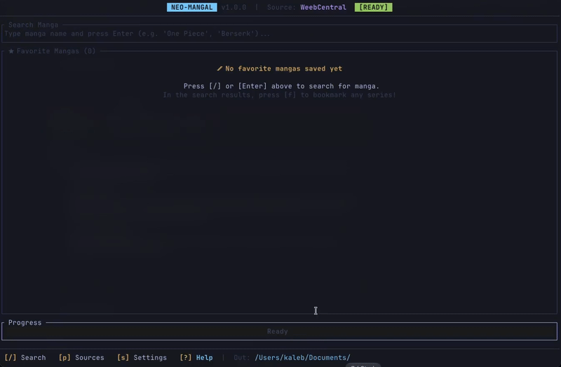

<h1 align="center">
<strong>Neomangal 1.0</strong>
</h1>

<p align="center">
    
    
</p>

`neo-mangal` is an **aggressive refactor and modern reimagining** of the original [mangal](https://github.com/metafates/mangal) by **metafates**, rewritten from the ground up in Rust. It pairs with [**neo-mangal-scrapers**](https://github.com/kalebhenrique/neo-mangal-scrapers) — an external Lua scraper repository — to actively maintain, revitalize, and advance the terminal manga reading and Kindle conversion experience with zero friction.

---

<p align="center">
    
</p>

## ✨ Features

- **Modular Lua Scrapers ([neo-mangal-scrapers](https://github.com/kalebhenrique/neo-mangal-scrapers))**: Scrapers are decoupled from the Rust core into external Lua 5.4 scripts—providing instant updates without recompiling, and concurrent multi-source search.
- **Native Kindle Optimization**: Direct conversion to Kindle KF8 (`.azw3`) at 300 PPI via Kindle Comic Converter (KCC)
- **Unified Download Pipeline**: Flexible output targeting **PDF**, **EPUB**, **CBZ**, **AZW3**, and **MOBI**, with optional volume fusion to merge multi-chapter releases into clean single-volume archives.
- **Pure-Rust Terminal Cover Preview**: High-definition cover thumbnails rendered directly in the terminal using TrueColor halfblocks with dynamic window-aware scaling—zero external C dependencies.
- **AniList Two-Way Sync**: Native integration with AniList. Track and update your reading progress directly from the chapter list with confirmation prompts, or enable background auto sync on download.
- **Modern TUI Architecture**: Built with `ratatui` and Tokio async tasks, featuring real-time progress bars, inline chapter filtering, wrap-around pagination, and clean immediate exit.

---

## 🔧 Prerequisites: KCC & Nerd Fonts

### 1. KCC CLI

> [!TIP]
> KCC is only required for Kindle and EPUB conversions (**AZW3**, **EPUB**, **MOBI**).

For automated background conversions without touching the GUI:

```bash
# Install pipx (if not already installed)
brew install pipx

# Install KCC CLI in an isolated user environment
pipx install git+https://github.com/ciromattia/kcc.git
```

### 2. KindleGen

KindleGen is required by KCC to produce Kindle formats (`AZW3` and `MOBI`).

#### macOS

Install **[Amazon Kindle Previewer](https://www.amazon.com/Kindle-Previewer/b?ie=UTF8&node=21381691011)** and `neo-mangal` automatically discovers `kindlegen` inside Kindle Previewer

#### Linux

Amazon discontinued standalone KindleGen downloads, but it remains fully usable on Linux:

- **Arch Linux / Manjaro (AUR)**:

  ```bash
  yay -S kindlegen
  ```

- **Debian / Ubuntu / Fedora**:
  Download `kindlegen` (or extract from archived package) and place it in `~/.local/bin/kindlegen` or `/usr/local/bin/kindlegen`:

  ```bash
  chmod +x ~/.local/bin/kindlegen
  ```

- **Custom Path via Configuration**:
  You can explicitly set the binary location in `~/.config/neo-mangal/config.toml`:

  ```toml
  kindlegen_path = "/path/to/your/kindlegen"
  ```

### 3. Nerd Fonts

`neo-mangal` uses [**Nerd Fonts**](https://www.nerdfonts.com/) glyphs for checkboxes, badges, and headers:

```bash
brew install --cask font-fira-code-nerd-font
```

**Linux**: Download from [nerdfonts.com/font-downloads](https://www.nerdfonts.com/font-downloads) and copy to `~/.local/share/fonts/`.

---

## 🚀 Installation & Update

### Quick Install (macOS & Linux)

Install `neo-mangal` and shortcuts (`nmangal`, `neomangal`, `neo-mangal`) into `~/.local/bin`:

```bash
curl -fsSL https://raw.githubusercontent.com/kalebhenrique/neo-mangal/main/install.sh | sh
```

### Updating

To update `neo-mangal` to the latest version at any time, run:

```bash
nmangal update
```

---

### Build from Source with make

```bash
git clone git@github.com:kalebhenrique/neo-mangal.git
cd neo-mangal
make install
```
